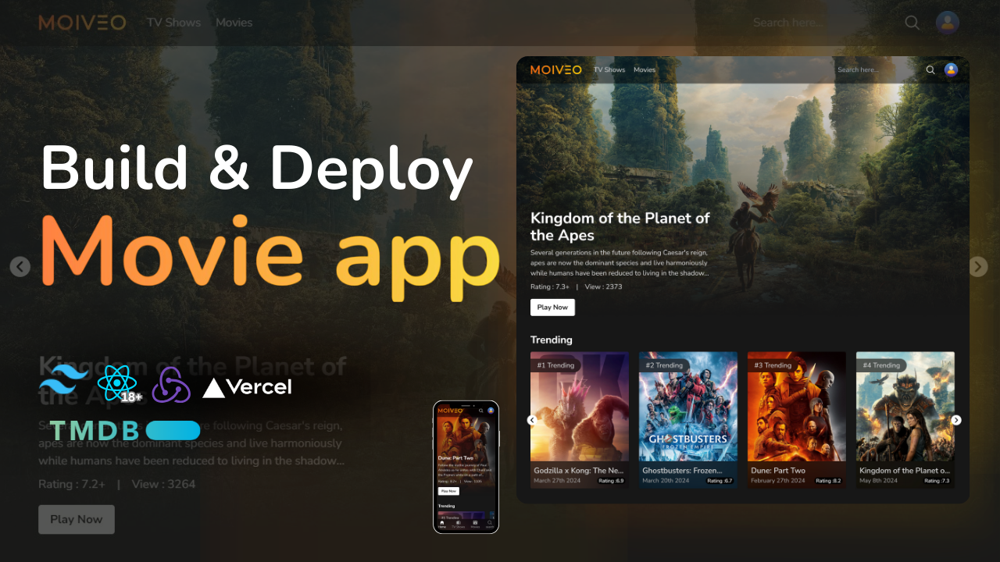

# Movie App



## Project Overview
A modern and responsive Movie Application built with React, Redux Toolkit, React Router, Axios, and Tailwind CSS.
Users can explore trending movies, view movie details, similar, and recommended movies — all in a beautiful and fast interface.

**Live Demo:** [Movie App](https://movie-app-nu-one-44.vercel.app/)

## Features
- Browse trending movies and TV shows
- View detailed information about each movie or tv show
- Display similar and recommended movies or tv shows
- Responsive design for all devices
- Built with performance and scalability in mind

## Tech Stack
- **React**
- **Tailwind CSS**
- **Redux Toolkit**
- **React Router DOM**
- **Axios**
- **Moment.js**
- **Vite**

## Project Structure
```
movieapp/
├── node_modules/
├── public/
│
├── src/
│   ├── assets/
│   │   ├── images
│   ├── components/
│   ├── constants/
│   ├── hooks/
│   ├── pages/
│   ├── routes/
│   ├── store/
│   ├── App.jsx
│   ├── main.jsx
│   └── index.css
│
├── package.json
├── postcss.config.js
├── tailwind.config.js
├── vite.config.js
└── README.md
```

## 👨‍💻 Author
**Eng. Abdelaziz Mohamed**

- [LinkedIn](https://www.linkedin.com/in/abdelaziz)
- [GitHub](https://github.com/Abdelaziz-Mohammed)